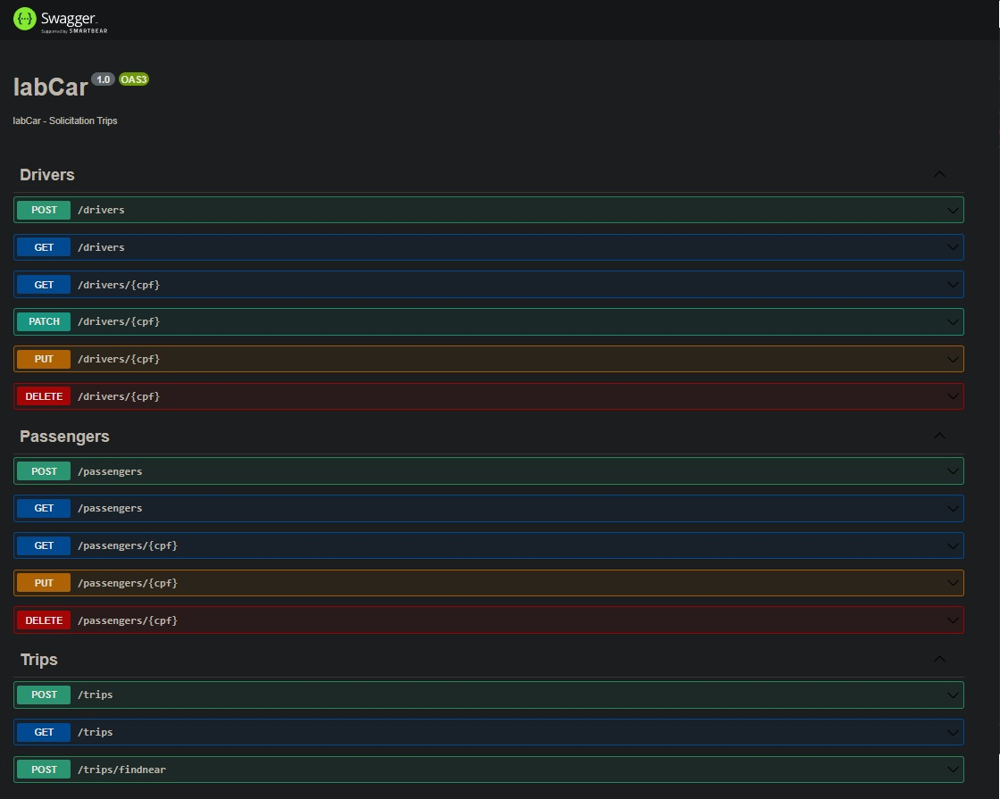
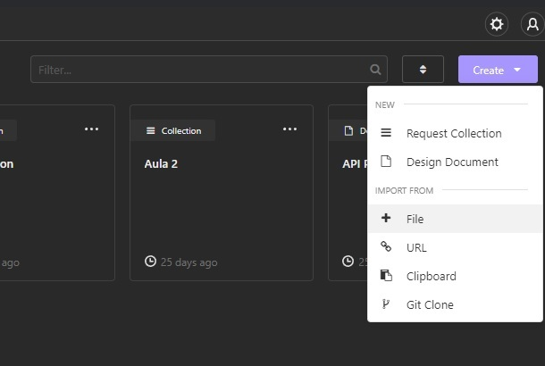
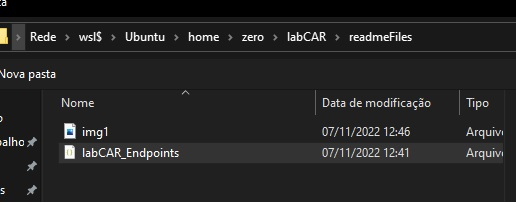
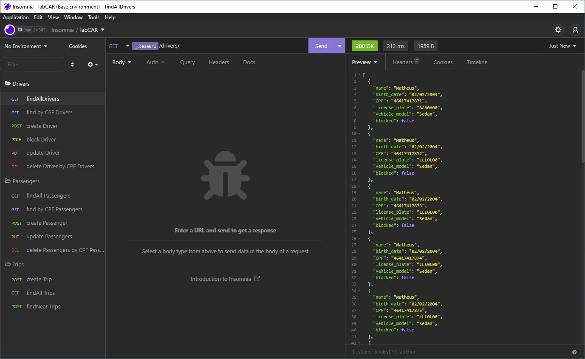

<p align="center">
  
</p>

[circleci-image]: https://img.shields.io/circleci/build/github/nestjs/nest/master?token=abc123def456
[circleci-url]: https://circleci.com/gh/nestjs/nest

  <h3 align="center">Projeto 1 Modulo backend DEVInHouse (Intelbras)</h3>
<p align="center">


</p>

## Rodando o projeto

### Clonando repositório

```bash
git clone https://github.com/Matheusvicentesn/labCAR.git .
```

### Instalando dependências

```bash
npm install
```

## Iniciando aplicação

```bash
npm run start:dev
```

## Acessando documentação

```bash
# Podendo ser acessada via navegador e outros clientes, ex: Postman,Insomnia
localhost:3000/api#/
```

<p align="center">
  
</p>

Caso queiram importar o arquivo Insomina com todos endpoints configurados basta importar a configuração.

Ir na opção de importar coleção por arquivo:

<p align="center">
  
</p>

Selecionar o arquivo que está na pasta clonada do projeto, readmeFiles>labCAR_Endpoints.json

<p align="center">
  
</p>

Pronto, todos os endPoints estarão configurados

<p align="center">
  
</p>

### Melhorias que poderão ser feitas no projeto posteriormente.

- [ ] Utilizar banco de dados para armazenar motoristas, passageiros e viagens.
- [ ] Utilizar API Directions do Google para realizar calculo de distâncias reais.
- [ ] Realizar deploy da aplicação.
- [ ] Criar endpoints adicionais para viagens, exemplos: Cancelar viagem, Aceitar Viagem, classificar Motorista, etc..

### Contato

Projeto desenvolvido com base na atividade do curso DEVinHouse
Qualquer dúvida ou sugestão estou disponível no e-mail:
<a href="mailto:contato@matheusvicente.dev.br?subject=Questions" title=""> contato@matheusvicente.dev.br</a>
